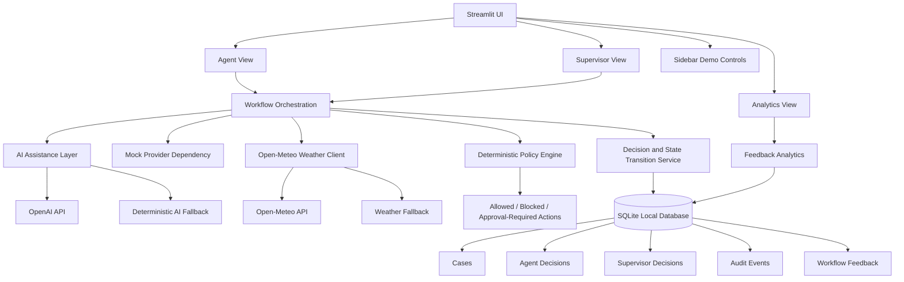
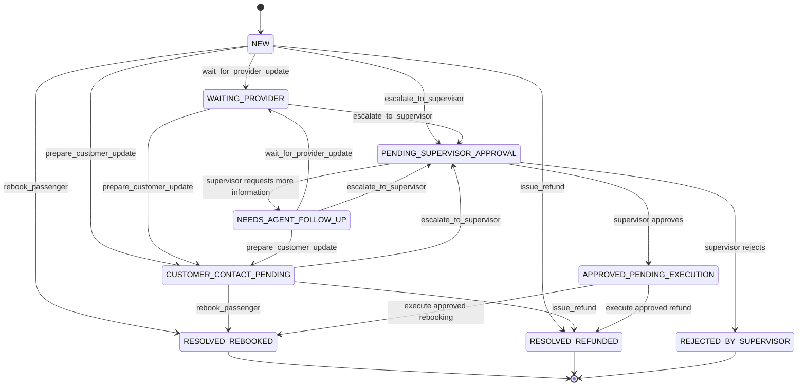
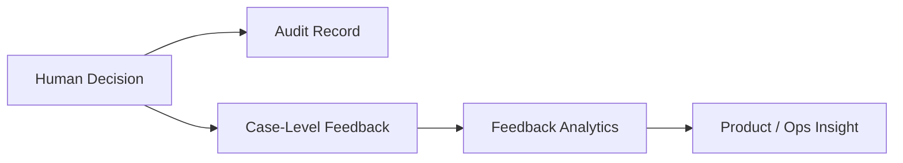
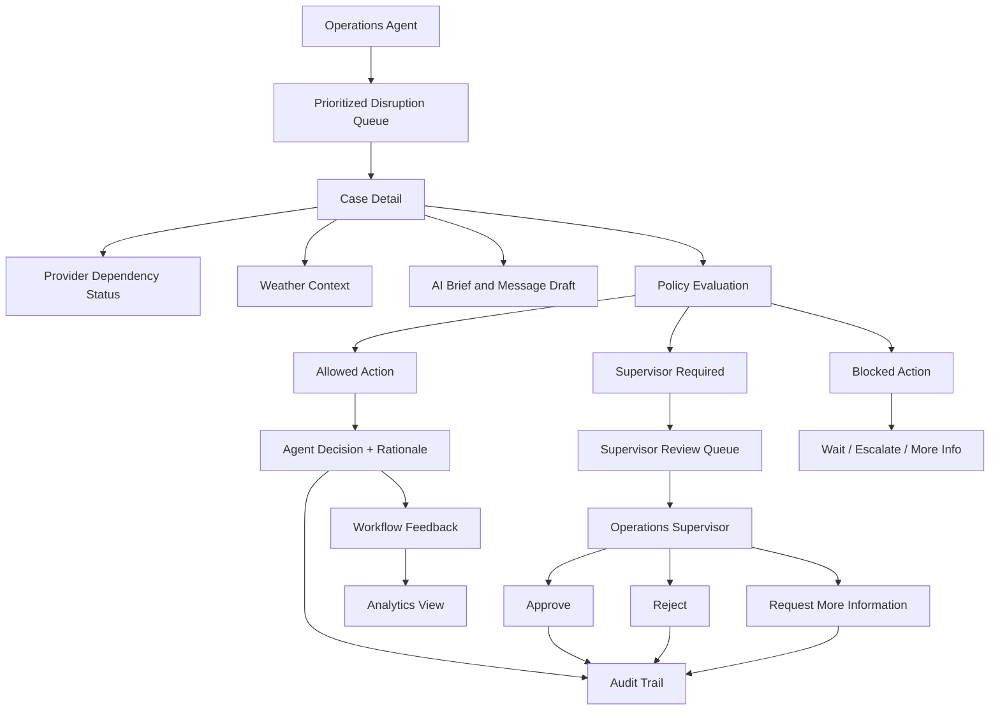

# Travel Disruption Operations Copilot

A product-grade operations workflow prototype for managing disrupted travel bookings.

This project explores how travel operations teams can prioritize disrupted bookings, evaluate provider-supplied recovery options, handle external dependency failures, apply deterministic policy controls, use bounded AI assistance, and capture human decisions with auditability and feedback loops.

---

## Product Thesis

Travel disruptions are not just customer support cases. They are time-sensitive operational workflows involving passenger impact, provider uncertainty, policy constraints, SLA pressure, cost risk, role-based approvals, and human judgment.

This system helps operations teams answer:

> What should we work on next, what actions are safe, what needs escalation, and what did we learn from the outcome?

---

## Core Principle

> AI helps agents understand and communicate.  
> Deterministic systems govern what actions are allowed.  
> Humans decide.  
> Audit and feedback records improve the workflow.

The system intentionally separates probabilistic AI assistance from deterministic workflow control.

---

## Why This Project Exists

This is Project 3 in my GitHub product portfolio.

The goal of this project is to demonstrate progression from:

1. **AI-assisted decision support**
2. **Human-in-the-loop operational workflow**
3. **Product-grade workflow UX with prioritization, external dependency realism, role-specific workflows, and feedback loops**

Earlier projects emphasized architecture, policy controls, workflow state, and auditability. This project deliberately pushes further into:

- operational queue design
- information hierarchy
- prioritization
- role-specific views
- external API degradation
- user confidence after actions
- feedback analytics
- product-grade workflow ergonomics

---

## Target Users

### Travel Operations Agent

Handles disrupted passenger bookings.

Needs to:

- identify which cases need attention first
- understand passenger impact quickly
- evaluate provider-supplied recovery options
- select a policy-valid action
- enter rationale
- submit workflow feedback

### Operations Supervisor

Reviews high-risk or approval-required cases.

Needs to:

- see cases pending supervisor review
- inspect agent decisions and rationale
- approve, reject, or request more information
- preserve auditability of decisions

### Product / Operations Lead

Looks at aggregate workflow performance.

Needs to understand:

- recommendation usefulness
- provider data quality
- override and escalation reasons
- passenger response / outcome patterns
- provider-level operational issues

---

## Implemented Capabilities

The current prototype includes:

- **Prioritized disruption queue** with severity, SLA status, action-needed labels, status filters, provider filters, disruption filters, and active-case toggle
- **Case detail view** with passenger context, route, disruption type, status, ticket value, special flags, and recommended next action
- **Mocked travel provider dependency** with success, partial response, stale data, timeout, unavailable provider, and no-option scenarios
- **Provider-supplied recovery options** including rebooking, refund, wait, and escalation paths
- **Open-Meteo weather enrichment** for origin and destination cities
- **Weather degraded fallback** when weather enrichment is unavailable or intentionally degraded
- **Bounded AI assistance** using OpenAI for operational summaries and passenger message drafts
- **Deterministic AI fallback** when OpenAI is unavailable or intentionally degraded
- **Deterministic policy engine** for allowed, blocked, and supervisor-required actions
- **Policy-aware decision panel** that only surfaces safe or approval-required actions
- **SQLite persistence** for case states, decisions, supervisor decisions, audit events, and feedback
- **Case state transitions** driven by agent and supervisor actions
- **Supervisor review workflow** for approval-required cases
- **Audit trail** for decisions, status changes, supervisor reviews, and feedback submission
- **Workflow feedback capture** tied to specific cases
- **Feedback analytics view** showing recommendation usefulness, provider data quality, override reasons, passenger outcomes, provider patterns, and disruption-type patterns
- **Sidebar demo controls** to force AI fallback and weather degradation for repeatable demo scenarios

---

## System Architecture



The architecture is intentionally modular:

- the UI presents role-specific workflows
- mocked provider responses model travel dependency uncertainty
- Open-Meteo provides real external enrichment
- OpenAI reduces cognitive load but does not govern actions
- deterministic policy defines safe action boundaries
- SQLite persists workflow state, decisions, audit records, and feedback

---

## Case Lifecycle



The state model keeps workflow progress explicit.

Agent and supervisor actions update case state, and every decision is persisted with an audit event.

---

## AI vs Deterministic Boundaries

| Responsibility | AI Assistance | Deterministic System | Human User |
|---|---:|---:|---:|
| Summarize disruption context | Yes | No | Reviews |
| Draft passenger message | Yes | No | Reviews / edits |
| Explain operational considerations | Yes | Partially | Reviews |
| Determine allowed actions | No | Yes | Reviews |
| Block unsafe actions | No | Yes | Cannot bypass |
| Require supervisor approval | No | Yes | Follows workflow |
| Submit action rationale | No | Validates requirement | Yes |
| Approve high-risk case | No | Routes for approval | Supervisor |
| Update case state | No | Yes | Triggers through action |
| Persist audit trail | No | Yes | Creates via workflow |
| Execute real refund/rebooking | No | Not implemented | Not implemented |

> AI summarizes and drafts. Deterministic systems govern. Humans decide.

---

## External Dependency Handling

The project models two types of external dependency.

### 1. Mocked Travel Provider Dependency

The travel provider dependency returns recovery data such as:

- rebooking options
- refund option
- wait recommendation
- escalation path
- no available options

It also models dependency states:

| Provider State | System Behavior |
|---|---|
| Success | Show recovery options and allow policy evaluation |
| Partial response | Warn that provider data may be incomplete |
| Stale data | Block normal rebooking and require caution |
| Provider unavailable | Block unsafe actions and guide toward wait/escalation |
| Timeout | Block unsafe actions and guide toward wait/escalation |

The provider dependency is mocked intentionally so failure modes are repeatable and demo-friendly.

### 2. Open-Meteo Weather Enrichment

The app uses the Open-Meteo API to enrich case context with current weather for origin and destination cities.

Weather is treated as contextual information, not as an action authority.

If weather is unavailable or intentionally degraded, the app continues to rely on provider status and deterministic policy.

---

## Demo Controls

The Streamlit sidebar includes demo controls for external dependency behavior.

Current controls include:

- **AI assistance service**
  - `healthy`
  - `force_fallback`

- **Weather enrichment service**
  - `healthy`
  - `force_degraded`

These controls make degraded behavior easy to demonstrate without:

- deleting API keys
- changing code
- waiting for real outages
- manually breaking API calls

This supports the project theme that failure modes should be visible, testable, and explainable.

---

## Feedback Loop

The system captures case-level workflow feedback.

Feedback includes:

- recommendation usefulness
- provider data quality
- override or escalation reason
- passenger response / outcome
- internal learning note

This creates a product learning loop:



The goal is not model retraining in the MVP.

The goal is to show how operational products can learn from human judgment, provider reliability issues, and passenger outcomes.

---

## Role-Based Workflow



---

## Tech Stack

- **Python**
- **Streamlit**
- **SQLite**
- **Pandas**
- **Requests**
- **python-dotenv**
- **OpenAI API**
- **Open-Meteo API**
- **Local mocked provider dependency**

---

## Current Status

The current prototype includes the main operational workflow:

```text
Agent queue
→ case detail
→ provider dependency status
→ weather enrichment
→ AI assistance
→ deterministic policy evaluation
→ policy-aware action submission
→ state transition
→ supervisor review when required
→ audit trail
→ feedback capture
→ feedback analytics
```

The project is locally runnable and uses SQLite for persisted workflow state.

---

## Product Walkthrough

Screenshots will be added in a later polish commit.

Planned walkthrough sections:

1. Agent disruption queue
2. Case detail and provider dependency status
3. Weather enrichment
4. AI operational brief and passenger message draft
5. Deterministic policy evaluation
6. Policy-aware decision submission
7. Supervisor review workflow
8. Feedback capture
9. Analytics view
10. Demo controls for degraded AI and weather fallback

---

## Supporting Product Artifacts

This project includes additional product documentation:

- [`PRODUCT_NOTES.md`](PRODUCT_NOTES.md) — product thesis, workflows, user roles, AI boundaries, lifecycle states, feedback loop, and future improvements
- [`TRADEOFFS.md`](TRADEOFFS.md) — key product and system trade-offs behind the prototype

---

## How to Run Locally

### 1. Clone the repository

```bash
git clone https://github.com/sunny-aryan/travel-disruption-ops-copilot.git
cd travel-disruption-ops-copilot
```

### 2. Create and activate a virtual environment

```bash
python3 -m venv .venv
source .venv/bin/activate
```

### 3. Install dependencies

```bash
pip install -r requirements.txt
```

### 4. Create a local `.env` file

```bash
cp .env.example .env
```

Add your OpenAI API key:

```text
OPENAI_API_KEY=your_api_key_here
```

The app can still run without an OpenAI key, but AI assistance will use deterministic fallback behavior.

### 5. Run the Streamlit app

```bash
streamlit run app.py
```

Streamlit will print a local URL in the terminal, usually:

```bash
http://localhost:8501
```

### 6. Local database behavior

The app uses SQLite for local persistence.

The generated database file is ignored by Git and can be safely reset:

```bash
rm data/disruption_ops.db
```

On restart, the app recreates the local database and seeds cases from:

```text
data/seed_cases.json
```

---

## Failure Modes Covered

| Failure Mode | System Behavior |
|---|---|
| OpenAI unavailable | Use deterministic AI fallback |
| AI intentionally degraded | Skip OpenAI and use fallback summary/message |
| Open-Meteo unavailable | Show degraded weather context |
| Weather intentionally degraded | Show forced degraded weather state |
| Provider timeout | Block unsafe actions and guide toward wait/escalation |
| Provider unavailable | Block unsafe actions and guide toward wait/escalation |
| Provider stale data | Warn user and block normal rebooking |
| Partial provider response | Show caution and require review for risky actions |
| High-value refund | Require supervisor approval |
| High-cost rebooking | Require supervisor approval |
| Sensitive passenger flags | Keep escalation path available |
| Missing rationale | Block or reject submission |
| Supervisor-required action | Route case to supervisor review queue |

---

## Success Metrics

### Workflow Metrics

- Time to first action
- Time to resolution
- Cases resolved within SLA
- Active cases by status
- Supervisor review volume
- Cases waiting on provider

### Quality Metrics

- Recommendation usefulness
- Provider data quality
- Override and escalation reasons
- Passenger response / outcome
- Reopened or follow-up cases

### Dependency Metrics

- AI fallback frequency
- Weather degradation frequency
- Provider timeout / unavailable frequency
- Stale provider data frequency

### Operational Metrics

- Resolution mix: rebooked, refunded, rejected, waiting provider, supervisor review
- Feedback count by provider
- Provider data issues by provider
- Escalation rate by disruption type

---

## Key Product Decisions

### 1. Build an operations console, not a full travel platform

The project focuses on workflow quality, prioritization, policy control, and degraded dependency handling rather than full travel inventory, ticketing, or refund execution.

### 2. Mock provider recovery options

Provider responses are mocked to make edge cases repeatable and demo-friendly.

### 3. Use real weather API only as enrichment

Open-Meteo adds real external context, but weather does not determine allowed actions.

### 4. Keep AI bounded

AI reduces cognitive load but does not approve, execute, or override policy.

### 5. Persist workflow state locally

SQLite keeps the project easy to run while demonstrating stateful workflow behavior.

### 6. Capture feedback at case level

Case-level feedback is simpler than decision-level feedback while still showing a meaningful product learning loop.

For detailed trade-offs, see [`TRADEOFFS.md`](TRADEOFFS.md).

---

## Future Improvements

- Integrate a real travel provider or mobility API
- Add real refund/rebooking execution boundary
- Persist AI-generated summaries and message drafts
- Add policy versioning and policy test cases
- Add case lookup for non-active supervisor cases
- Add recently reviewed supervisor cases
- Add role-based permissions
- Add richer SLA breach handling
- Add notification or messaging integration
- Add provider incident clustering
- Add automated tests for policy and state transitions
- Move from SQLite to Postgres for production-style deployment
- Add screenshots and a guided README walkthrough